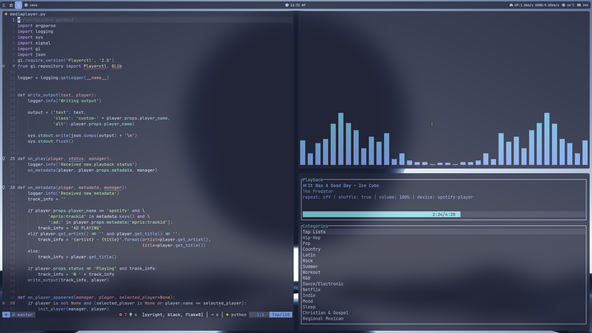
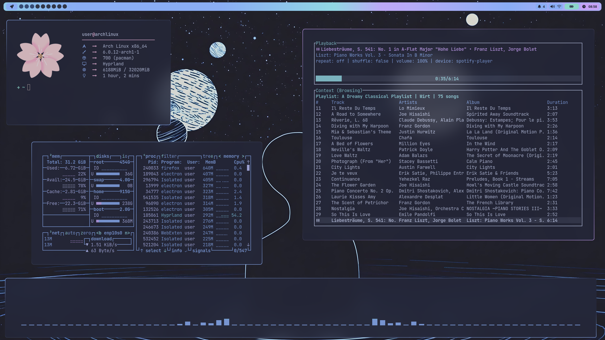

# Hyprland dotfiles

These dotfiles are curated for Hyprland on arch linux, however many other distros will probably work fine.


## Screenshots



## Video 
[](https://www.youtube.com/watch?v=fbTBhCGZBOQ)

## Details
- **Compositor** - [Hyprland](https://hyprland.org)
- **Shell** - [zsh](https://wiki.archlinux.org/title/zsh) [(zap plugin manager)](https://www.zapzsh.org/)
- **Terminal** - [kitty](https://github.com/kovidgoyal/kitty)
- **Bar and Widgets** - [eww](https://github.com/elkowar/eww)
- **Launcher** - [wofi](https://github.com/uncomfyhalomacro/wofi)
- **Notifications** - [dunst](https://github.com/dunst-project/dunst)
- **Text Editor/IDE** - [Lunar Vim](https://www.lunarvim.org/)
- **Spotify TUI App** - [spotify-player](https://github.com/aome510/spotify-player)
- **File Manager** - [lf](https://github.com/gokcehan/lf)
- **Audio Visualizer** - [cava](https://github.com/karlstav/cava)
- **Resource Monitor** - [btop](https://github.com/aristocratos/btop)
- **PDF Viewer** - [zathura](https://github.com/pwmt/zathura)
- **Wallpapers** - Can be found in a separate repo [here](https://github.com/selmer443/wallpapers)


## Notable Features
- Animated Widgets for managing notifications, volume, input vol, etc.
- Clipboard history integrated into wofi (keybinding: Super+Shift+V)
- Dictionary Search using dictd and integrated into wofi (keybinding: Super+Shift+D)
- Wallpaper picker integrated into wofi and persistent through reboots, using swww for transitions (keybinding: Super+Shift+C)
- Opacity toggle for all windows using hyprctl, (keybinding: Super+Shift+Z)

## Installation

Dependencies, Please let me know if this list is incomplete, I will try my best to keep it up to date.

```bash
  paru -S chezmoi hyprland-git xdg-desktop-portal-hyprland-git grim cava slurp wl-clipboard socat swappy cliphist swaylock-effects-git wofi dunst jq eww-wayland swww-git zathura-pdf-mupdf zathura lf spotify-dev spotify-player neofetch kitty-git btop dictd moreutils pamixer wf-recorder unimatrix-git playerctl pistol-git ttf-material-design-icons-desktop-git pacman-contrib checkupdates+aur
```
You will need the themes repo cloned inside ~/.local/share
```
cd ~/.local/share
git clone https://github.com/Selmer443/themes.git
cd themes
git submodule init
git submodule update
```

You can either clone this repo and copy configs manually or use chezmoi to copy them all at once.
It's important to note that some of these configs depend on one another, be aware of this when copying
manually.

```bash
  git clone https://github.com/Selmer443/dotfiles.git
  cd dotfiles 
```
Then copy the configs and scripts as you'd like, Or use your favorite AUR helper
to install chezmoi and run the command below:

```bash
  paru -S chezmoi
  chezmoi init --apply https://github.com/Selmer443/dotfiles.git
```    
You will need to ensure that your path includes the .local/.scripts directory for everything to work properly, if nothing else make sure you run the theme changer script theme_changer_wl, it should open wofi for you and you should select catppuccin macchiato as that is the only theme with full support as of now. Feel free to open issues and PRs, I am busy with school as of now but will still try to improve this config and make it accessible to as many people as possible. Thank you for taking interest in my rice :)
